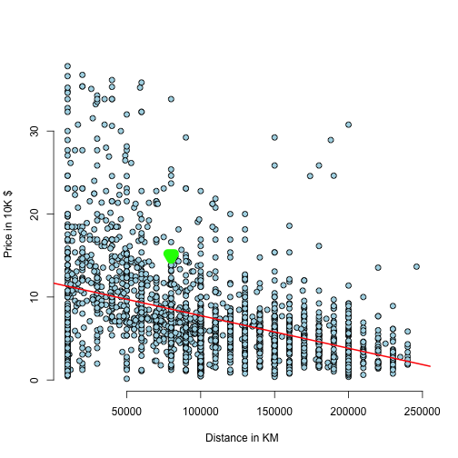

DevelopingDataProductHomework
========================================================
author: wind  
date: Jan 27, 2016

Introduction
========================================================
How to evluate the price of a used cars.
Predict the used car price according to the driven distance.

The second car price usually correlated by following factors.

- Used Years
- Driven Distance
- Brand
- New Car Price
- and more

Find the price caused with the driven distance only.
=======================================================
The dataset collected from the internet from a car discusstion forum.
The users post the used cars price, here only extract the price and the one covirace Distance.

```
'data.frame':	2115 obs. of  2 variables:
 $ Price   : num  9.85 4 3.31 12.62 18.58 ...
 $ Distance: int  70000 120000 170000 13000 160000 20000 110000 100000 200000 73000 ...
```

Train the model
========================================================

```r
lm.Dist <- lm(Price ~ Distance, data = UsedCars)
confint(lm.Dist)
```

```
                    2.5 %        97.5 %
(Intercept)  1.122861e+01  1.214859e+01
Distance    -4.320446e-05 -3.544597e-05
```

```r
coef(lm.Dist)
```

```
  (Intercept)      Distance 
 1.168860e+01 -3.932521e-05 
```

PLot the linear Model
========================================================
Here we can see the used car price decreasing
while the Driven distance increased.

Predfict the used car price
=======================================================
The Rshiny accept one Input which is driven Distance.
For example,
Input Driven distance of your car is : 89,000KM.
The predicated result:


```r
inputDist <- data.frame(89000)
names(inputDist) <- "Distance"
yourCar <- predict(lm.Dist, newdata = inputDist)
yourCar
```

```
       1 
8.188656 
```

